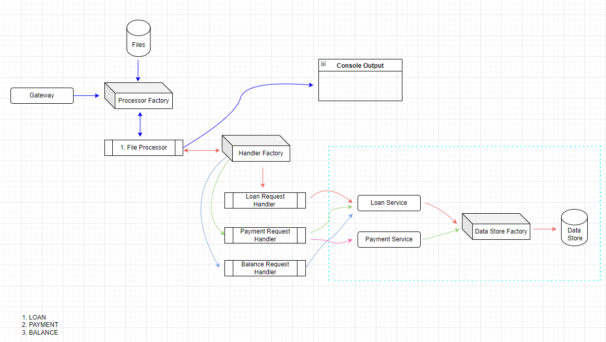

# LedgerCo

Solution For Ledger Co problem



To build the solution use below command

```
dotnet build -o ledgerco
```

To get the output you can use below commands

```
dotnet ledgerco/ledgerco.dll FileInput/Input1.txt
dotnet ledgerco/ledgerco.dll FileInput/Input2.txt
```

To execute test cases execute below command

```
dotnet test
```

For calculating the test coverage run below command

```
dotnet test --collect="XPlat Code Coverage"
```

Generated report will be avilable here

```
Ledger\Ledger.Test\TestResults
```

Questions?

1. no of emi's could be a float number?
2. should Loan tenure always be in years? can it be months?
3. can a user take multiple loans from same bank?
4. difference between lumpsum and emi?
